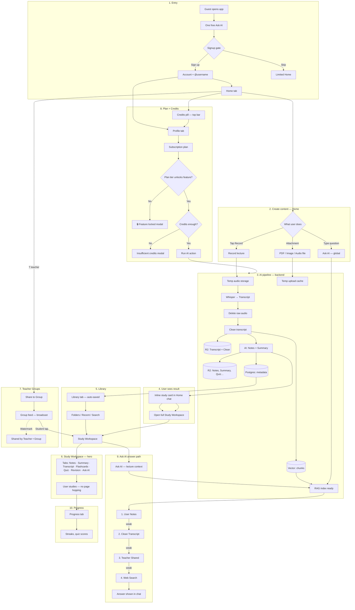

# ExamSpark — App Flow

> **Saved:** Jul 2026 — pre-Phase 2 documentation
> **Audience:** Founder (non-developer)
> **Purpose:** One picture of how the whole app works, start to finish

**Companion:** [`IA_SCREEN_HIERARCHY.md`](IA_SCREEN_HIERARCHY.md) · [`FEATURES_MASTER.md`](FEATURES_MASTER.md) · [`DATA_STORAGE_POLICY.md`](DATA_STORAGE_POLICY.md)

---

## The story in plain language

1. **Guest** opens app → tries Ask AI once free  
2. **Signup** → gets account + @username  
3. **Record** (or upload) a lecture on **Home**  
4. AI makes **Transcript** → then **Notes** + **Summary**  
5. Everything auto-saves to **Library**  
6. User opens **Study Workspace** — Notes, Quiz, Flashcards in one place  
7. **Teacher** shares to **Groups** — students read (no chat)  
8. **Subscription** plan decides which features unlock  
9. **Credits** pay for each AI action  
10. **Ask AI** answers using Notes → Transcript → Web  

---

## Master flow diagram



---

## Step-by-step journeys

### A. Guest → first value

```
Open app
    → Home (no account)
    → Type one question
    → AI answers
    → Popup: "Create account to save & unlock more"
    → Sign up OR leave
```

### B. Student — study day

```
Login
    → Home: Ask doubt OR open Library
    → Library → Physics → Lecture 12
    → Study Workspace → Quiz tab
    → Progress: see score
    → Groups: open teacher's shared homework
```

### C. Teacher — teach day

```
Login
    → Home → Record 45 min lecture
    → Same chat: "Processing…" then Notes ready
    → Groups → Physics Batch → Share
    → Students see in feed
    → Profile → Dashboard: check active students
```

---

## Flow by tab (after Phase 2 UI)

| Tab | User goes here to… |
|-----|-------------------|
| **Home** | Ask AI, record, upload, see conversation |
| **Library** | Find saved lectures |
| **Groups** | See teacher content (feed) |
| **Progress** | Track study stats |
| **Profile** | Plan, credits, settings, logout |

---

## Where credits appear in the flow

```
Every AI action (record, quiz, Ask AI, flashcards…)
        ↓
Check plan tier (Free / ₹199 / ₹499 / ₹999 / Teacher)
        ↓
Check credit balance
        ↓
Deduct on server (user never sees ₹ amount)
        ↓
Show remaining credits on Home pill + Profile
```

---

## Where subscription appears

```
Profile → Subscription
    → See current plan
    → Compare plans
    → Upgrade (payment — Phase 5)
    → Higher plan unlocks Record, PDF, full features
```

---

## What is NOT in this flow yet (honest)

| Step | Status |
|------|--------|
| Guest free Ask AI | Docs only |
| Inline study in Home chat | Docs only — code jumps to Processing screen |
| Library / Groups / Progress tabs | Docs only |
| Study Workspace widget | Docs only |
| R2 storage | Docs only |
| Full RAG 4-tier | Docs only |
| Live payments | Not connected |

**Old prototype path today:** Record → Processing screen → Notes Result screen (will change in Phase 2).

---

## Simple ASCII overview

```
        GUEST
          │
          ▼
      SIGN UP ──────────────────────────────┐
          │                                  │
          ▼                                  ▼
        HOME ◄──────────────────────── PROFILE
          │                               (Plan/Credits)
    ┌─────┼─────┐
    │     │     │
  Ask AI Record Upload
    │     │     │
    │     └──► AI PIPELINE ──► LIBRARY (auto-save)
    │              │              │
    │              ▼              ▼
    │         STUDY WORKSPACE ◄───┘
    │         (Notes/Quiz/…)
    │
    └──► ASK AI (RAG: Notes→Transcript→Web)

    TEACHER: Record ──► SHARE ──► GROUPS ──► STUDENTS read
```

---

## Changelog

| Date | Change |
|------|--------|
| Jul 2026 | APP_FLOW.md — full journey + mermaid diagram |
