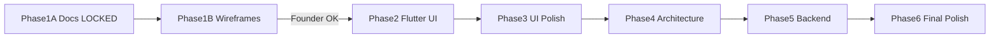

# ExamSpark — Permanent Development Workflow

> **Saved:** Jul 11, 2026 — founder mandate
> **Status:** OFFICIAL — permanent unless founder says **"Update Development Workflow"**
> **Audience:** Founder (non-developer) + AI agents + contributors

**Companion:** [`PROJECT_WORKING_RULES.md`](PROJECT_WORKING_RULES.md) · [`PROJECT_ROADMAP.md`](PROJECT_ROADMAP.md)

---

## Memory Rule

This workflow is **permanent**. Treat it as the official ExamSpark development process.

**Do not replace or override** unless the founder explicitly says:

> **"Update Development Workflow"**

---

## Model Strategy

### Phase 1A — Product Foundation ✅ LOCKED

| Item | Detail |
|------|--------|
| **Model** | Sonnet 5 High |
| **Output** | Documentation only |
| **No** | Flutter · Backend |

**Deliverables:**

- Product Vision
- PRD
- Information Architecture
- Navigation Flow
- User Flow
- Teacher Flow
- Student Flow
- Library Flow
- Group Flow
- Credits Architecture
- Storage Policy
- Folder Structure
- Development Rules

**Output files:**

- `PROJECT_ROADMAP.md`
- `PROJECT_WORKING_RULES.md`
- `ARCHITECTURE.md`
- `APP_FLOW.md`
- `FEATURES_MASTER.md`
- `DATA_STORAGE_POLICY.md`
- `CHANGELOG.md`
- `TODO.md`
- `README.md`
- Plus: `PRD.md`, `UX_ARCHITECTURE.md`, `IA_SCREEN_HIERARCHY.md`, `PROJECT_CORE_RULES.md`, `TECH_STACK.md`, `CREDIT_ECONOMY.md`, `TEACHER_PLATFORM.md`

**Status:** 🔒 **LOCKED** Jul 11, 2026 — no further edits without founder approval.

---

### Phase 1B — Low Fidelity Wireframes

| Item | Detail |
|------|--------|
| **Model** | Sonnet 5 High |
| **Output** | Wireframes only |
| **No** | Flutter code |

**Create BOTH:**

- Mobile wireframes
- Desktop wireframes

**Every screen must show:**

- Header
- Navigation
- Content
- Bottom bar
- Buttons
- Floating Actions
- Popups
- Sheet placement

**Gate:** Founder approval required **before** Flutter starts.

**Status:** 🟡 **Draft created** — see [`WIREFRAMES.md`](WIREFRAMES.md) (22 screens/states, Mobile + Desktop) — awaiting founder approval. Phase 2 (`AppShell`) explicitly held back until approved (founder instruction Jul 11, 2026).

---

### Phase 2 — Flutter UI

| Item | Detail |
|------|--------|
| **Model** | Sonnet 5 High |
| **Output** | Flutter UI only |
| **Data** | Placeholder only — no backend |

**Do NOT touch:**

- Supabase Authentication
- Login Logic
- Signup Logic
- Existing Database Logic
- Existing Edge Functions

**Allowed:**

- Theme
- Responsive UI
- Components
- Animations
- Home · Library · Groups · Progress · Profile · Workspace

**Gate:** Phase 1B wireframes approved + founder says **"Phase 2 shuru karo"**.

**Status:** ⏳ Blocked until 1B approved.

---

### Phase 3 — UI Polish

| Item | Detail |
|------|--------|
| **Model** | GPT-5.5 Medium |
| **Never** | Redesign architecture |

**Tasks:**

- Padding · Icons · Typography · Colors
- Responsive fixes · Refactoring · Bug fixing
- Small widgets · Accessibility

**Status:** ⏳ Pending.

---

### Phase 4 — Architecture (Data Layer)

| Item | Detail |
|------|--------|
| **Model** | Sonnet 5 High |
| **Note** | Backend APIs still not implemented |

**Implement:**

- Supabase · SQL · Credits · Storage
- Cloudflare R2 · Vector Database · RAG
- Teacher Dashboard data · Permissions · Group System

**Status:** ⏳ Pending.

---

### Phase 5 — Backend

| Item | Detail |
|------|--------|
| **Model** | Sonnet 5 High |

**Implement:**

- FastAPI · APIs · Authentication
- Payments: Razorpay · Google Play Billing · PhonePe
- Cloudflare R2 · pgvector
- Groq · Qwen

**Status:** ⏳ Pending.

---

### Phase 6 — Final Polish

| Item | Detail |
|------|--------|
| **Model** | GPT-5.5 Medium |

**Tasks:**

- Testing · Bug fixing
- Remove unused files (founder confirmation first)
- Documentation update
- Performance · Final cleanup

**Status:** ⏳ Pending.

---

## Sonnet Budget Strategy

| Phase | Budget share |
|-------|--------------|
| Phase 1A | 15% |
| Phase 1B | 10% |
| Phase 2 | 35% |
| Phase 4 | 20% |
| Phase 5 | 20% |

**Rule:** Never waste Sonnet credits on small fixes. Small work = **GPT-5.5 Medium**.

---

## Mandatory Founder Rules

Founder is **NOT** a developer.

Always explain every technical step in **simple language**.

**Never assume knowledge of:**

- SQL · Flutter · Git · FastAPI · Supabase · Cloudflare

Always explain manually. Copy-paste commands when possible.

---

## Manual Setup Rule

After **EVERY** coding task, generate:

| Section | Required |
|---------|----------|
| ✅ What was coded | Yes |
| 📄 Files changed | Yes |
| ⚠ Manual setup required | Yes |
| ⚠ SQL required | If applicable |
| ⚠ Supabase changes | If applicable |
| ⚠ Cloudflare changes | If applicable |
| ⚠ .env variables required | If applicable |
| 🧪 How to test | Yes |
| Expected result | Yes |
| Rollback steps | Yes |

**No feature is complete until Manual Setup Checklist + .env Checklist are both explained.**

Full detail: [`PROJECT_WORKING_RULES.md`](PROJECT_WORKING_RULES.md) §12–13

---

## .env Rule

**Canonical reference:** [`API_SETUP.md`](API_SETUP.md) — every variable, phase, dashboard link, and paste location.

Whenever a new service is added, tell the founder which variables to add (use names from `API_SETUP.md` only).

**Quick template (Phase 4 core):**

```env
SUPABASE_URL=
SUPABASE_ANON_KEY=
GROQ_API_KEY=
OPENROUTER_API_KEY=
TAVILY_API_KEY=
R2_BUCKET_NAME=
R2_ACCESS_KEY_ID=
R2_SECRET_ACCESS_KEY=
```

For each key explain:

- Where to get it (see `API_SETUP.md` dashboard links)
- Where to paste it (`examspark_frontend/.env` or `examspark_backend/.env`)
- Whether restart is required

---

## Cleanup Rule

**Never delete any file automatically.**

Before deleting:

1. Verify usage
2. Explain why it can be removed
3. Ask for confirmation
4. Then delete

---

## Phase Rule

**Never automatically move to the next phase.**

At the end of every phase:

1. Audit everything
2. Verify documentation
3. Verify project structure
4. Verify implementation
5. Report missing items
6. **Wait for founder approval**

---

## UI Rule

**Before writing Flutter UI:**

Always create **low fidelity wireframes first** (Phase 1B).

Only after founder approval → start Flutter coding (Phase 2).

---

## Authentication Rule

**Never rewrite or break existing authentication.**

- Reuse existing login/signup logic (`SupabaseClient`, `AuthGate`, `LoginScreen`)
- Only redesign UI
- Authentication changes **only** when founder explicitly requests them

---

## Phase Flow (Visual)



---

## Changelog

| Date | Change |
|------|--------|
| Jul 11, 2026 | Permanent Development Workflow saved — founder mandate |
