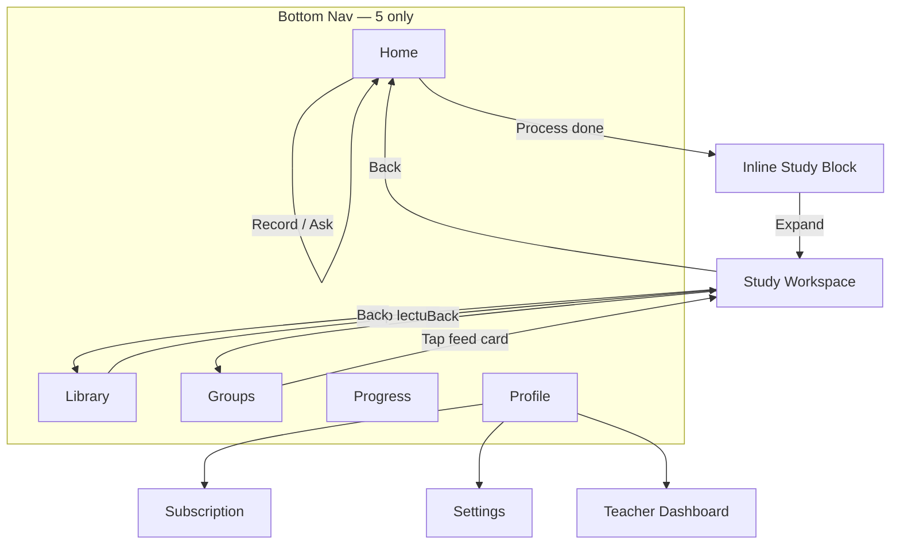

# ExamSpark — UX Architecture

> **Saved:** Jul 2026 — founder `save all` (+ Profile, IA, design process)
> **Design intent:** Premium AI SaaS — not a traditional education app
> **Process:** Information Architecture → Navigation Flow → Screen Hierarchy → UI

**Related:** [`PRD.md`](PRD.md) · [`CREDIT_ECONOMY.md`](CREDIT_ECONOMY.md)

---

## 1. Design Principles

| Principle | Rule |
|-----------|------|
| **30-second clarity** | User understands app in 30s: chat home, library, groups, profile |
| **Reduce taps** | Study in one workspace; no per-feature pages |
| **Logical placement** | Every feature has exactly one primary home |
| **No unnecessary screens** | Modals/sheets over routes; tabs over stacks |
| **Easy discovery** | 5 bottom tabs + Home input bar = 90% of actions |
| **Premium AI SaaS** | White, black, minimal — not colorful edu-app |
| **Center focus** | Home = conversation canvas |
| **One workspace** | Lecture = one screen, tabs inside |
| **Reusable components** | Same `StudyWorkspace` everywhere |

---

## 2. Design Process Order (Mandatory)

**Never jump to UI mockups first.** Always in this sequence:

```
1. Information Architecture   ← what exists, how content is organized
2. Navigation Flow            ← how user moves between areas
3. Screen Hierarchy           ← parent/child, modals vs pages
4. UI                         ← visual design last
```

---

## 2b. Core Differentiator — Conversation + Study Workspace

> **ChatGPT = conversation only.**  
> **ExamSpark = conversation + Study Workspace.**

Yahi product ko ChatGPT se alag aur education-focused banata hai. User ko baar-baar pages change nahi karne padenge — **ek hi lecture ke andar saari study**.

### The pattern

| Surface | Conversation | Study Workspace |
|---------|--------------|-----------------|
| **Home** | Ask AI thread, record bubbles | Inline compact tabs after processing |
| **Library / Groups** | — | Full workspace on lecture open |
| **Desktop** | Left or center (chat) | **Right panel** — tabs always visible |
| **Mobile** | Full screen chat or lecture | **Bottom sheet** — swipe up for study tabs |

### Desktop — split pane

```
┌─────────────────────────┬────────────────────────────────┐
│  Conversation           │  Electromagnetism Ch.12        │
│  (Home thread)          │  Mr. Sharma · Physics          │
│                         ├────────────────────────────────┤
│  User: Recorded lecture │  Notes │ Summary │ Transcript  │
│                         │  Flashcards │ Quiz │ Revision  │
│  AI: ✓ Ready below      │  Ask AI                        │
│                         ├────────────────────────────────┤
│                         │  [Active tab content]          │
│                         │                                │
├─────────────────────────┴────────────────────────────────┤
│  📎  │  Message…                              │ 🎤 │ ↑  │
└──────────────────────────────────────────────────────────┘
```

### Mobile — bottom sheet

```
┌──────────────────────────────────┐
│  Conversation / Lecture header   │
├──────────────────────────────────┤
│                                  │
│   Main content area              │
│                                  │
├──────────────────────────────────┤
│  ═══ Study Workspace ═══  ▲      │  ← drag handle
│  Notes│Summary│Transcript│+     │
│  [Tab content scrolls here]      │
├──────────────────────────────────┤
│  📎  │  Message…        │ 🎤 │↑ │
└──────────────────────────────────┘
```

Swipe up expands sheet to ~80% height. Tabs remain one tap away.

### Canonical tab order (v1)

```
📄 Notes  |  📑 Summary  |  🎧 Transcript  |  🧠 Flashcards  |  📝 Quiz  |  📚 Revision  |  ❓ Ask AI
```

**Default open:** Notes (from Library/Groups) · Notes (from Home inline after processing)

### Rules

| ✅ | ❌ |
|----|-----|
| All study in one workspace | Separate page per feature |
| Tab switch only | `/quiz`, `/flashcards` routes |
| Ask AI tab = lecture-locked context | Global Ask AI stays on Home input |
| Same `StudyWorkspace` widget everywhere | Duplicate result screens |

**Product pitch:** *"ChatGPT-simple AI + everything you need to study the lecture — without leaving."*

---

## 3. Information Architecture

```
ExamSpark
├── Home (Conversation)
│   ├── Ask AI threads
│   ├── Record / Upload entries
│   └── Inline Study Block (post-processing)
│
├── Library (Saved content)
│   ├── Folders (Subjects)
│   ├── Recent · Favorites · Search
│   └── Lecture → Study Workspace
│
├── Groups (Teacher broadcast)
│   ├── Group list
│   ├── Group feed (pinned + shares)
│   └── Feed item → Study Workspace
│
├── Progress (Student metrics)
│   ├── Study streak · Quiz completion
│   └── Weak topics (future)
│
├── Profile (Account & plan)
│   ├── Subscription
│   ├── Credits · Storage · Library Size
│   ├── Settings · Help · Logout
│   └── Teacher Dashboard (teacher only)
│
└── Study Workspace (shared layer — not a tab)
    ├── Transcript · Notes · Summary
    ├── Flashcards · Quiz · Revision · Ask AI
    └── AI Actions / + overflow
```

**Content types (where they live):**

| Content | Primary IA home | Secondary access |
|---------|-----------------|------------------|
| Live Ask AI | Home conversation | Workspace Ask AI tab |
| Recordings | Home → inline result | Library |
| Notes / Summary | Workspace tabs | Home inline |
| Flashcards / Quiz | Workspace tabs | Home AI Actions |
| Teacher shares | Groups feed | Library (unlocked copy) |
| Plan / Credits | Profile | Home credits pill |
| Analytics | Teacher Dashboard | Profile entry |

---

## 4. Navigation Flow



### Tap budget (targets)

| Task | Max taps from Home |
|------|-------------------|
| Ask AI | 1 (type + send) |
| Record lecture | 1 (🎤) |
| Open saved lecture | 2 (Library → card) |
| Take quiz | 2 (Library → Quiz tab) |
| Check credits | 1 (top pill) or 2 (Profile) |
| Upgrade plan | 2 (Profile → Subscription) |
| Share to group (teacher) | 3 (Groups → Share → pick) |

---

## 5. Screen Hierarchy

### Tier 1 — Bottom tabs (always reachable, 1 tap)

Home · Library · Groups · Progress · Profile

### Tier 2 — Full screens (push from Tier 1)

| Screen | Parent | Back goes to |
|--------|--------|--------------|
| Study Workspace | Home / Library / Groups | Parent |
| Group Feed | Groups list | Groups |
| Folder drill-down | Library | Library |
| Teacher Dashboard | Profile | Profile |
| Subscription detail | Profile | Profile |
| Settings | Profile | Profile |

### Tier 3 — Overlays (no new route)

| Overlay | Trigger |
|---------|---------|
| Sign Up Gate | After first Ask AI |
| Upload picker | Home 📎 |
| Share sheet | Groups + button |
| Insufficient credits | AI action blocked |
| Plan locked | Feature gated |

### ❌ Do NOT create

- Separate `/quiz`, `/flashcards`, `/notes` routes
- `/teacher` and `/student` as top-level portals
- `/processing` and `/notes_result` as post-record destinations
- 6th bottom tab for Dashboard or Settings
- Feature grid landing page

---

## 6. App Shell — Bottom Navigation

```
Home  |  Library  |  Groups  |  Progress  |  Profile
```

**Nothing more. Nothing less.**

Teacher Dashboard, Subscription, Settings — all inside Profile or overlays.

### Role-aware tab content

| Tab | Student | Teacher |
|-----|---------|---------|
| Home | Ask AI + record | Record prominent |
| Library | Own + group content | Own recordings |
| Groups | Joined feed (read) | Create, share, pin |
| Progress | Personal study stats | Light snapshot + Dashboard link |
| Profile | Account + plan | + Teacher Dashboard row |

---

## 7. Home Screen

### Layout

```
┌──────────────────────────────────────────────────────────┐
│  ExamSpark          🔍     ● 1,245     🔔     👤        │
├──────────────────────────────────────────────────────────┤
│                    CONVERSATION AREA                     │
│                    (scrollable, center-weighted)         │
├──────────────────────────────────────────────────────────┤
│  📎  │  Message ExamSpark…              │  🎤  │  ↑  │
└──────────────────────────────────────────────────────────┘
```

### Top bar — exactly 5 items

Logo · Search · Credits pill · Notification · Profile

**Forbidden on Home canvas:** Teacher/Student portal icons, Library shortcut, feature grids, banners.

### Bottom input

| Control | Action |
|---------|--------|
| 📎 | PDF · Image · Audio file |
| Text | Ask AI, multi-line |
| 🎤 | Start recording (inline bubble) |
| ↑ | Send |

### Empty state

Centered: *"Start recording or ask anything..."* — no feature carousel.

### Anonymous trial

One free Ask AI → full answer → elegant signup sheet after value delivered.

---

## 8. Recording — Stay in Conversation

**Hard rule:** NO `Navigator.push` to Processing or Notes Result screens.

```
Tap 🎤 → User bubble "● Recording… 04:32"
→ Stop → "Processing…" in same bubble
→ AI finishes → AI message with embedded Study Block below
```

User can scroll away; status remains in thread.

---

## 9. Inline Study Block (Home)

After processing, inside AI response message:

### Layer 1 — Study Tabs

```
Notes  |  Summary  |  Transcript
─────────────────────────────────
[Tab content scrolls inside card]
```

### Layer 2 — AI Actions (one section only)

```
AI Actions
[ Ask AI ] [ Flashcards ] [ Quiz ] [ MCQ ]
[ Revision ] [ Important Questions ] [ Formula Sheet ]
[ Mind Map ↗ ] [ Translate ] [ Voice Read ]
```

| Rule | Detail |
|------|--------|
| Placement | Only in this block — not scattered |
| One-click | Tap → generate inline or expand |
| Future | Mind Map = "Soon" chip |
| Expand | "Open full workspace" → full Study Workspace screen |

### Message types

`user_text` · `user_record` · `user_attachment` · `ai_text` · `ai_lecture_result` (with Study Block)

---

## 10. Library Screen

Bottom tab: **📚 Library**

### Sections

| Section | Purpose |
|---------|---------|
| **Folders** | Subject-based (Physics, Chemistry…) |
| **Search** | Title, teacher, subject, snippet |
| **Recent** | Last opened |
| **Favorites** | ⭐ pinned |

### Filter chips

`Recent` · `Favorites` · `All`

### Lecture card

```
Electromagnetism Ch.12
Mr. Sharma · Physics · 12 Mar 2026        ⋮
```

⋮ menu: Favorite · Move folder · Share (teacher) · Delete

**Tap** → Study Workspace (full screen)

### Folder drill-down

```
← Physics
Electromagnetism Ch.12     12 Mar
Thermodynamics Unit 3      8 Mar
```

---

## 11. Study Workspace (Reusable) — Hero Component

**The #1 product differentiator.** See §2b for desktop split + mobile bottom sheet.

Used from: Home expand · Library · Groups

### Tab bar (canonical order)

```
📄 Notes  |  📑 Summary  |  🎧 Transcript  |  🧠 Flashcards  |  📝 Quiz  |  📚 Revision  |  ❓ Ask AI
```

### Full-screen mode (Library / Groups / Home expand)

```
┌──────────────────────────────────────────────────────────┐
│  ←  Electromagnetism Ch.12                               │
│      Mr. Sharma · Physics · 12 Mar 2026                  │
├──────────────────────────────────────────────────────────┤
│  Notes │ Summary │ Transcript │ Flashcards │ Quiz │     │
│  Revision │ Ask AI                              [ + ]   │
├──────────────────────────────────────────────────────────┤
│              [ Active tab content ]                      │
└──────────────────────────────────────────────────────────┘
```

### Responsive modes

| Mode | When | Layout |
|------|------|--------|
| `inline` | Home — post-processing | Compact tabs inside AI message card |
| `split` | Desktop ≥1024px | Conversation left · Workspace right panel |
| `sheet` | Mobile / tablet | Bottom sheet, swipe to expand |
| `full` | Library / Groups tap | Full screen with header + tabs |

### `+` overflow

Important Questions · Formula Sheet · Mind Map (future) · Translate · Voice Read

### Rules

| ✅ | ❌ |
|----|-----|
| Tab switch = same screen | Separate route per tab |
| Generate updates tab inline | Nested page stack |
| One back → Library/Home/Groups | |

### Compact vs full

| Mode | Where | Tabs |
|------|-------|------|
| `compact: true` | Home inline embed | Notes · Summary · Transcript (+ AI Actions below) |
| `compact: false` | Library / Groups / split / sheet | Full 7-tab bar |

---

## 12. Groups Screen

Bottom tab: **👨‍🏫 Groups**

WhatsApp **list → feed** rhythm. **Not** a chat app.

### Group list

```
Physics Batch                              12 Mar  📌
Mr. Sharma · 120 students
```

Teacher: **+ New Group** · Student: join via code/link

### Group feed

```
📌 PINNED
Unit Test — Revision Notes

Lecture 12 — Electromagnetism
Notes · Summary · Quiz                Today

Homework — Chapter 4
Assignment · Due Fri                  Yesterday
```

**No message input. No chat bubbles.**

### Teacher share types

Upload Lecture · Share Notes · Share Summary · Share Quiz · Share Assignment · Share Homework · Pin

Share flow: Pick from Library → choose assets → broadcast to feed.

### Student permissions

| ✅ | ❌ |
|----|-----|
| Read feed | Send messages |
| Open → Study Workspace | Upload |
| Take Quiz | Pin / share |
| Ask AI (lecture context) | |
| Download if teacher allows | |

### Group settings (teacher)

`☐ Allow downloads` (default OFF)

### Sharing policy (strict)

- **Teacher only** shares content to group
- **Students:** invite link only — never notes/PDF/transcript/export
- Future: invite link may cost 100 credits (configurable)
- Shared views watermarked: `Shared by: {Teacher} • {Group}`

See [`PROJECT_CORE_RULES.md`](PROJECT_CORE_RULES.md) §3–4

### Access rules

| Scenario | Behavior |
|----------|----------|
| Joined before share | Immediate access |
| Joined after share | Post-join content only |
| Subscription expired | Read-only / locked per plan |

**Tap feed card** → Study Workspace with group context header.

---

## 13. Teacher Dashboard

**Entry:** Profile → Teacher Dashboard

Cards only — no spreadsheet tables.

### Metric cards (2×4 grid)

Students · Monthly Subscribers · New Students · Revenue  
Credits Used · Storage Used · Lecture Hours · Groups

### Analytics card (single block)

- Active this week
- Most opened lecture
- Quiz completion %
- Top group

### Quick links (card rows)

Today's Lectures · Assignments · Subscribers

Tables only when necessary — prefer card lists.

---

## 14. Profile Screen

Bottom tab: **Profile**

Account hub — not a settings dump. Clean list rows, premium spacing.

```
┌──────────────────────────────────────────────────────────┐
│  @username                                               │
│  student@email.com                                       │
├──────────────────────────────────────────────────────────┤
│  Subscription          Premium ›                          │
│  Credits               1,245 remaining ›                  │
│  Storage               4.2 GB / 10 GB  ████░░ ›          │
│  Library Size          28 lectures · 1.8 GB ›            │
├──────────────────────────────────────────────────────────┤
│  Settings              ›                                │
│  Help                  ›                                │
│  Teacher Dashboard     ›   (teacher only)               │
├──────────────────────────────────────────────────────────┤
│  Logout                                                  │
└──────────────────────────────────────────────────────────┘
```

### Profile rows

| Row | Tap opens | Notes |
|-----|-----------|-------|
| **Subscription** | Plan comparison + upgrade | Not on bottom nav |
| **Credits** | Usage detail + buy/upgrade | Mirror of Home pill |
| **Storage** | Breakdown by type | AI processing storage |
| **Library Size** | Lecture count + space | Links to Library |
| **Settings** | Account, notifications, teacher toggles | Save Original Audio here |
| **Help** | FAQ + contact | |
| **Teacher Dashboard** | Dashboard cards | Teacher role only |
| **Logout** | Confirm → Auth | Bottom of list, destructive style |

### What is NOT on Profile

- Record button (Home only)
- Library browser (Library tab)
- Groups (Groups tab)
- Study features (Workspace only)

Credits quick glance: **Home top bar pill** → tap shortcuts to Profile › Credits or Subscription.

---

## 15. Feature Placement Matrix

Every feature — one logical primary place. No orphans.

| Feature | Primary place | Secondary |
|---------|---------------|-----------|
| Record | Home 🎤 | — |
| Ask AI (global) | Home input | — |
| Ask AI (lecture) | Workspace › Ask AI tab | Home AI Actions |
| Upload PDF / Image / Audio | Home 📎 | — |
| Notes | Workspace › Notes | Home inline tab |
| Summary | Workspace › Summary | Home inline tab |
| Transcript | Workspace › Transcript | Home inline tab |
| Flashcards | Workspace › Flashcards | Home AI Actions |
| Quiz / MCQ | Workspace › Quiz | Home AI Actions |
| Revision | Workspace › Revision | Home AI Actions |
| Important Questions | Workspace › + menu | Home AI Actions |
| Formula Sheet | Workspace › + menu | Future |
| Mind Map | Workspace › + menu | Future |
| Translate | Workspace › + menu | Future |
| Voice Read | Workspace › + menu | Future |
| Search (content) | Library search | Home top bar (global) |
| Folders / Subjects | Library | — |
| Recent / Favorites | Library | — |
| Teacher Groups | Groups tab | — |
| Share to Group | Groups › Share sheet | Workspace ⋮ menu |
| Pin post | Groups feed | Teacher only |
| Progress / stats | Progress tab | — |
| Subscription | Profile › Subscription | Credits pill |
| Credits balance | Home pill + Profile | — |
| Storage / Library Size | Profile | — |
| Settings | Profile › Settings | — |
| Teacher Analytics | Profile › Dashboard | Groups header link |
| Notifications | Home 🔔 | — |
| Help | Profile › Help | — |
| Logout | Profile | — |

---

## 16. Responsive Behavior

| Breakpoint | Layout |
|------------|--------|
| Mobile (&lt;600px) | Bottom nav · full-screen Workspace · sticky input |
| Tablet (600–1024px) | Bottom nav · horizontal scroll tabs |
| Desktop (&gt;1024px) | Optional sidebar (recent chats) · thread max ~768px centered · Workspace split pane optional |

---

## 17. Component Map (Implementation Reference)

```
AppShell (5-tab)
├── HomeScreen
│   ├── TopBar
│   ├── ConversationList
│   │   └── MessageBubble
│   │       └── LectureResultCard (compact StudyWorkspace)
│   └── BottomInputBar
├── LibraryScreen
│   ├── Search · Filters · FolderList · LectureCardList
├── GroupsScreen
│   ├── GroupList · GroupFeed · ShareSheet
├── ProgressScreen
├── ProfileScreen
│   └── → TeacherDashboardScreen
└── StudyWorkspace (shared)
    ├── WorkspaceHeader
    ├── WorkspaceTabBar
    ├── WorkspaceTabContent
    └── WorkspaceActions
```

---

## 18. Current Scaffold Gaps

| Area | Today | Target |
|------|-------|--------|
| Navigation | Route-based, no bottom nav | 5-tab shell |
| Home | Sidebar + extra icons | Chat + 5-item top bar |
| After record | `/processing` → `/notes_result` | Inline in conversation |
| Library | Sidebar on Home | Dedicated tab |
| Groups | `StudentPortalScreen` | Groups feed |
| Workspace | `NotesResultScreen` standalone | Reusable `StudyWorkspace` |

---

## Changelog

| Date | Change |
|------|--------|
| Jul 2026 | UX Architecture v1 — Home, Library, Workspace, Groups, Dashboard |
| Jul 2026 | v1.1 — IA, Navigation Flow, Screen Hierarchy, Profile spec, design process order |
| Jul 2026 | v1.2 — Study Workspace hero differentiator; desktop split + mobile bottom sheet; canonical tab order |
